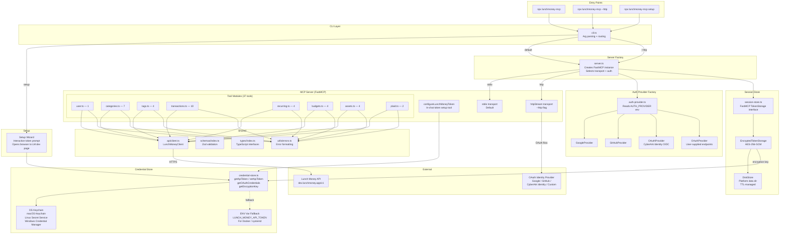
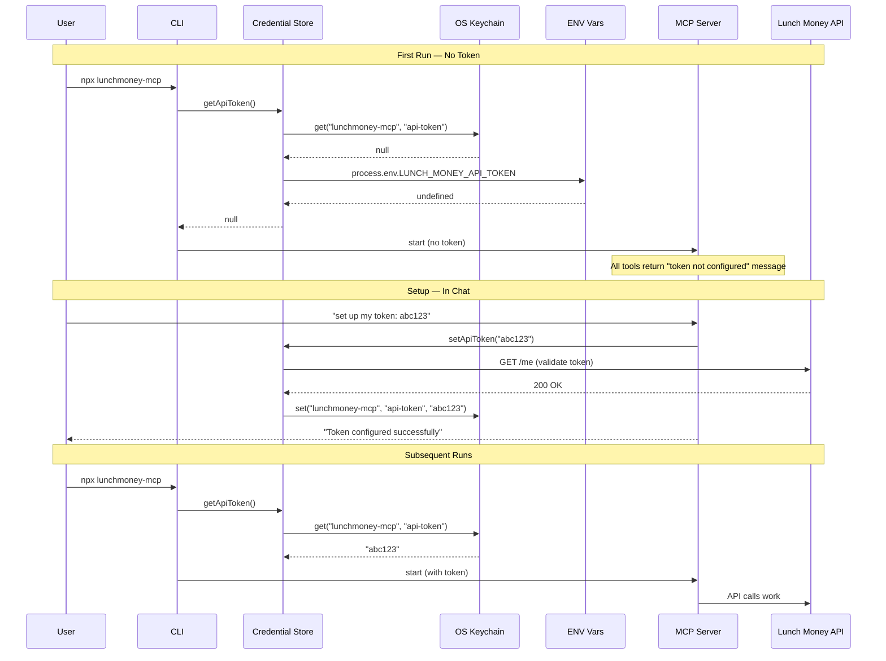
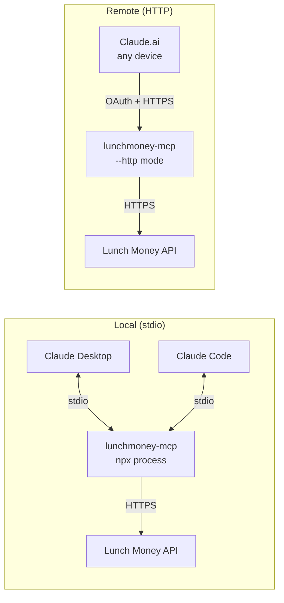

# Architecture: lunchmoney-mcp

## Module Responsibilities

| Module | Interface | Internals | Testability |
|--------|-----------|-----------|-------------|
| **CLI** | `--http`, `setup`, `--version` flags | Arg parsing, routing to server factory or setup wizard | Unit test arg parsing, mock server/wizard |
| **Credential Store** | `getApiToken()`, `setApiToken()`, `getOAuthCredentials()`, `getEncryptionKey()`, `clear()` | OS keychain via `keytar`, ENV var fallback detection, service namespace management | Mock keychain, test fallback chain |
| **Session Store** | FastMCP `TokenStorage` interface (`set`, `get`, `delete`) | `EncryptedTokenStorage` wrapping `DiskStore`, encryption key from credential store, `env-paths` for data directory | Mock credential store, test encryption round-trip |
| **Auth Provider Factory** | `createAuthProvider(provider, credentialStore): AuthProvider` | Provider selection switch, credential retrieval, FastMCP provider instantiation | Test each provider path, test invalid provider error |
| **Server Factory** | `createServer(options): FastMCP` | Transport selection, auth provider wiring, tool registration, `configureLunchMoneyToken` tool | Mock FastMCP, test transport + auth combinations |
| **Setup Wizard** | `runSetup(): Promise<void>` | Interactive prompts, browser open, token validation (`GET /me`), keychain storage | Mock readline + keychain, test validation flow |
| **Tool Modules (8)** | 37 `addTool()` registrations | API calls via `LunchMoneyClient`, Zod validation, error formatting | Already tested — 157 tests, >90% coverage |

## Credential Flow

## Deployment Architecture

