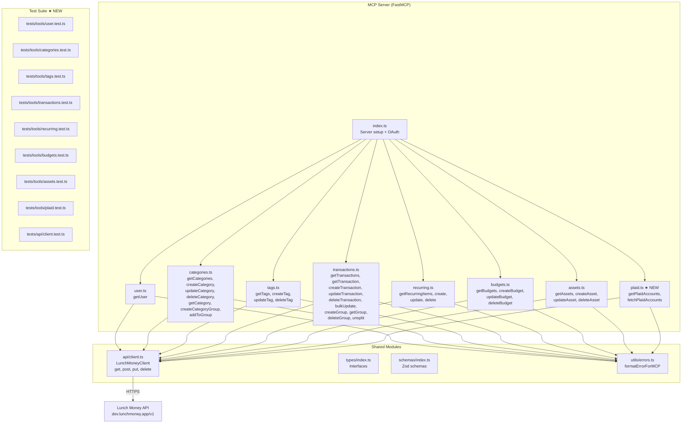

# Architecture

```mermaid
graph LR
    subgraph Clients
        CW[Claude.ai Web]
        CM[Claude.ai Mobile]
        CD[Claude Desktop]
    end

    subgraph "Cloudflare Edge"
        CF_ACCESS[Cloudflare Access<br/>Service Token Auth<br/>client_credentials]
        CF_WAF[WAF Rate Limiting<br/>10 req/min/IP on /health]
        CF_TUNNEL[Cloudflare Tunnel<br/>lunchmoney-mcp.joe-garcia.com]
    end

    subgraph "Hetzner VPS (178.156.141.254)"
        CLOUDFLARED[cloudflared<br/>systemd service]
        MCP[lunch-money-mcp<br/>Node.js / FastMCP<br/>systemd service<br/>user: lunchmoney]
        ENV[/etc/lunchmoney-mcp/env<br/>LUNCH_MONEY_API_TOKEN<br/>SERVER_API_KEY<br/>root:root 0600]
        HEALTH[/health endpoint<br/>unauthenticated]
        MCP_EP[/mcp endpoint<br/>Bearer token auth]
    end

    subgraph "External API"
        LM[Lunch Money API<br/>api.lunchmoney.app]
    end

    CW & CM & CD -->|OAuth client_credentials| CF_ACCESS
    CF_ACCESS -->|authenticated| CF_TUNNEL
    CF_WAF -.->|rate limit| HEALTH
    CF_TUNNEL -->|outbound tunnel| CLOUDFLARED
    CLOUDFLARED -->|localhost:8080| MCP
    ENV -.->|EnvironmentFile| MCP
    MCP --> HEALTH
    MCP --> MCP_EP
    MCP_EP -->|Bearer token| LM
```

## Component Responsibilities

| Component | Responsibility |
|-----------|---------------|
| **Cloudflare Access** | Edge authentication via Service Tokens (OAuth client_credentials). Per-user tokens for Joe and wife. Rejects unauthenticated requests before they reach the VPS. |
| **Cloudflare WAF** | Rate limiting on `/health` endpoint (10 req/min/IP). DDoS protection on all endpoints. |
| **Cloudflare Tunnel** | Routes `lunchmoney-mcp.joe-garcia.com` to the VPS via outbound-only connection. SSL termination. |
| **cloudflared (systemd)** | Tunnel daemon on VPS. Maintains persistent connection to Cloudflare edge. Forwards traffic to `localhost:8080`. |
| **lunch-money-mcp (systemd)** | FastMCP Node.js server. Serves MCP tools on `/mcp`, healthcheck on `/health`. Authenticates requests via `SERVER_API_KEY` Bearer token. Runs as non-root `lunchmoney` user. |
| **Environment file** | Stores `LUNCH_MONEY_API_TOKEN` and `SERVER_API_KEY`. Root-owned, mode 0600. Read by systemd before privilege drop. |
| **Lunch Money API** | External financial data API. Accessed by the MCP server using `LUNCH_MONEY_API_TOKEN`. |

## Auth Flow

1. User configures MCP integration in Claude.ai with server URL
2. Claude.ai initiates OAuth 2.1 flow via FastMCP's GoogleProvider
3. User authenticates with Google (joe@joe-garcia.com or charissa.s.garcia@gmail.com)
4. FastMCP issues JWT, Claude.ai uses it for subsequent requests
5. Request passes through Cloudflare Tunnel → cloudflared → localhost:8090
6. MCP server processes the request, calling Lunch Money API as needed
7. Response flows back through the tunnel to Claude.ai

## MCP Tool Modules



★ = new in this PRD
